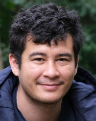
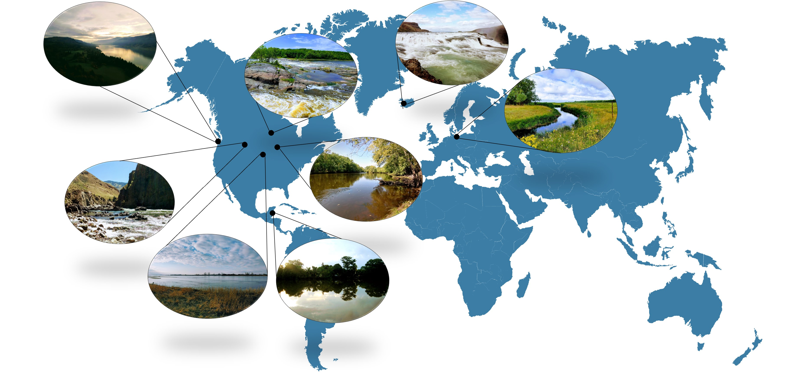

```{r setup, include=FALSE}
knitr::opts_chunk$set(echo = FALSE)
```

::: {.floatting}
```{r out.width='30%', out.extra='style="float:right; padding:10px"'}
library(knitr)

```

My passion for the aquatic world and science started at an early age. I grew up on a small river in rural Minnesota, the Snake. The “research” I conducted during my childhood ranged from experimenting with fish feeding behaviors in my aquarium, testing flight distance responses of cryptic species, to trying to estimate migratory patterns of fish communities. Of course, at that time, I did not see these as research topics for ecology; they were just inherent outlets for my insatiable curiosity framed in the context of fishing. I found myself questioning every aspect of the river and its inhabitants, from form to function. What would the river look like in 10, 100, or even 1000 years from now? How would the fish communities change in response to a changing river? Would all rivers change in the same way? How would I go about answering these questions so far into the future? With almost infectious like qualities, any attempt to find answers only continued to produce more questions. This process of questioning and answer-seeking has grown into an integral part of my life and continues to fuel my motivation to study aquatic ecosystems around the world and the organisms that reside in them.
:::

```{r}
library(knitr)

```

